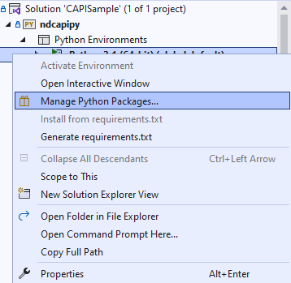

# Python CAPI Sample

This directory contains a Python combined API sample for Polaris and Aurora.

`ndcapipy` contains the following modules:

- **ndtypes** - common data types used by `ndcapipy`
- **datafile** - reading and writing NDI data files in CSV format
- **comm** - basic communication with NDI devices
- **capi** - implementation of Combined API for Polaris and Aurora
- **ndtracker** - common interface to NDI devices. Includes implementation of
  - Aurora v3
  - Vega/Lyra
  - Spectra/Vicra

## How to use
The Python sample is created with a Visual Studio solution file. It was developed Anaconda for Python 3.1 on Windows, but experienced Python developers will know how to deploy a working Python development environment.

*Note*: you may use Visual Studio Code if you do not have an enterprise version of Visual Studio.

### Install the Conda Package Manager - Windows

1. If you already have Python installed on your computer, you will need to uninstall it before beginning the Conda installation process.
1. Download the Windows version of the Miniconda3 installer wizard here: https://docs.conda.io/projects/miniconda/en/latest/
1. Run the Conda installation wizard you downloaded in the previous step.
   1. Follow the wizard instructions until you reach the step to "Customize how Miniconda3 integrates with Windows".
   1. In the "Advanced Installation Options", check the "Add Minconda3 to my PATH environment variable".

### Install Visual Studio with Python Support - Windows
Use the Visual Studio installer to ensure you have Python 3 support in your Visual Studio installation.

If you are using Visual Studio code, follow these instructions:
1. Open Visual Studio, and launch the "VS Code marketplace".
1. Search for Python.
1. Choose the "Python" extension, and install it.

### Opening ndcapipy in Visual Studio - Windows
1. Start Visual Studio.
1. Import the CAPISample.sln solution file.
1. Ensure Visual Studio finds the source files as well as the Python 3 that is on the %PATH%.

### Serial port support in Visual Studio - Windows
1. In the Visual Studio solution, select the Python 3.x Environment and use the "Manage packages..."

1. Ensure that the "`serial`" and "`pyserial`" packages are installed.

The included environment.yml file specifies the same.

### Running the sample
If you are using the Visual Studio solution, edit the properties of the ndcapipy project. Use the "Script arguments" section to set the command-line arguments for the script.

Run the script to see how the sample connects to the specified system.

Learn how the command-line arguments work by opening the sample.py source file:

``sample.py <connection> [-l|--load <Polaris wireless tool SROM file path>] [-t|--time <Length of time to track>] [-p|--port <Port to connect to on socket>]``

Connections could be, for example, "P9-12345" to connect to an NDI Polaris Vega with that serial number, or "COM7" to connect to an NDI Polaris Spectra, Vicra, or Vega, or NDI Aurora v3 on a virtual COM port.